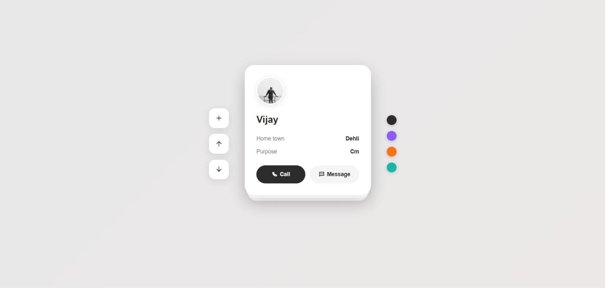
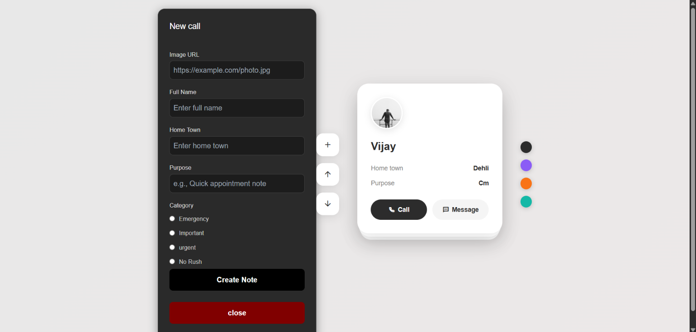
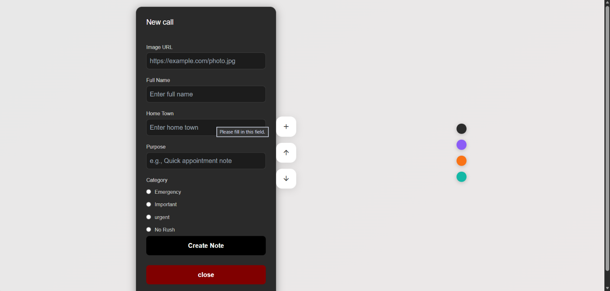

# 📋 Call Notes APP – Interactive Contact Card Stack

A simple and interactive **Call Notes / Contact Card Stack** built using **HTML, CSS and JavaScript**.

The project allows users to create contact notes with an image, name, hometown, purpose and category. Notes are stored in the browser using **LocalStorage** and displayed as an interactive stacked-card interface.

## 🚀 Live Demo

🔗 Link :- https://call-notes-app.vercel.app/


---

## 📸 Screenshot







---

## ✨ Features

* ➕ Create a new contact/call note
* 👤 Add profile image using an image URL
* 📝 Add full name, hometown and purpose
* 🏷️ Select a note category:

  * Emergency
  * Important
  * Urgent
  * No Rush
* 💾 Save notes using **LocalStorage**
* 🃏 Display notes as a stacked-card layout
* ⬆️ Move cards upward through the stack
* ⬇️ Move cards downward through the stack
* 🎨 Clean and minimal UI
* 🖱️ Hover animations and interactive buttons
* 📱 Simple browser-based application with no backend required

---

## 🛠️ Tech Stack

* **HTML5** – Structure
* **CSS3** – Styling, layout and animations
* **JavaScript (ES6+)** – DOM manipulation and application logic
* **LocalStorage** – Client-side data persistence
* **Tailwind CSS CDN** – Included in the HTML
* **Remix Icon** – Interface icons

---

## 🧠 How It Works

### 1. Create a Note

Click the **+ button** to open the note creation form.

The form collects:

* Image URL
* Full Name
* Home Town
* Purpose
* Category

The form also performs basic validation before creating a note.

### 2. Save Data

After submission, the note is stored inside the browser's **LocalStorage** under the `tasks` key.

```javascript
localStorage.setItem("tasks", JSON.stringify(oldTasks));
```

### 3. Display Cards

JavaScript reads the saved notes and dynamically creates the cards using DOM manipulation.

Each card displays:

* Profile image
* Name
* Home town
* Purpose
* Call button
* Message button

### 4. Card Stack

The cards are displayed in a stacked layout. JavaScript dynamically changes their:

* `z-index`
* `transform`
* `opacity`

to create the stacked-card effect.

---

## 📂 Project Structure

```text
call-notes-app/
│
├── index.html
├── style.css
├── script.js
│
├── screenshots/
│   ├── 1.main-interface.png
|   ├── 2.create-note-form.png
|   └── 3.form-validation.png
│
└── README.md
```

---


## 🎯 Learning Outcomes

While building this project, I practiced:

* DOM Selection
* DOM Manipulation
* Event Listeners
* Form Handling
* Form Validation
* Functions
* Arrays and Objects
* `forEach()`
* Dynamic Element Creation
* `localStorage`
* JSON `stringify()` and `parse()`
* CSS Transitions
* CSS Transforms
* Interactive UI Design

---

## 👨‍💻 Author

**Manoj Anand Madke**

CSE (AI & ML) Graduate | Frontend Web Development Learner

* GitHub: https://github.com/ManojMadke
* LinkedIn: https://www.linkedin.com/in/manoj-madke

---

⭐ If you like this project, feel free to **star the repository**!
